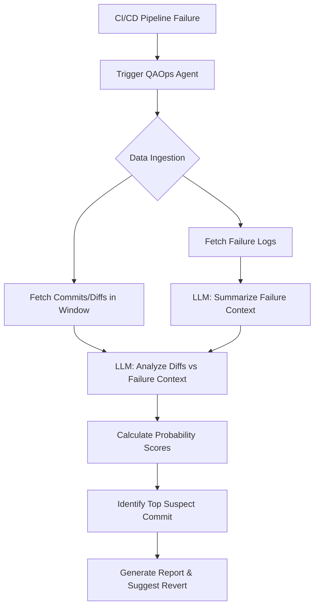

# QAOps Agent: Commit Fault Localizer

This agent addresses the problem of identifying the specific commit responsible for a build or test failure when there are multiple commits between the last passing and first failing state. By leveraging Agentic AI to semantically analyze both the failure logs and the code changes (diffs) of the commits in that window, it saves significant debugging time and effort.

## Resolved Decisions

*   **Log Ingestion**: The agent will be designed to accept failure logs generically (e.g., via a plain text file, API payload, or standard input) so it can integrate with any CI/CD platform (Jenkins, GitHub Actions, etc.).
*   **Target Language**: The semantic analysis will be language-agnostic. Prompts will rely on the LLM's general programming knowledge to interpret diffs from any language.
*   **Revert Action**: The agent will first suggest the revert command and the responsible commit. It will incorporate a human-in-the-loop review step; upon approval, it can create a Revert PR via the GitHub API.
*   **Frameworks**: LangChain and LangGraph will be used to orchestrate the workflow, with raw API calls utilized where frameworks add unnecessary overhead.
*   **LLM Provider**: Google Gemini AI.
*   **Version Control**: Primary interaction will be with the GitHub API (no local cloning required).

## Prerequisites & Required Keys

Before we begin execution, please ensure you have the following API keys ready to export as environment variables (do **NOT** paste them in our chat for security reasons; just confirm when you have them ready and we will set them in an `.env` file or terminal session):

1.  **`GITHUB_TOKEN`**: A GitHub Personal Access Token (classic or fine-grained) with `repo` scope to read commits, PRs, and optionally create a revert PR.
2.  **`GEMINI_API_KEY`**: An API key for Google Gemini (e.g., via Google AI Studio or Vertex AI) to power the LangChain/LangGraph agents.

## Proposed Changes

We will build a modular Python application using LangGraph to manage the agentic state and flow.

### 1. Data Ingestion & GitHub API Module

*   **Functionality**: Fetch commits, PR descriptions, and code diffs between `last_passing_commit` and `first_failing_commit`. Accept raw text for the CI/CD failure logs.
*   **Libraries**: `PyGithub` (for GitHub API interactions) and `requests` for generic API calls if needed.

### 2. Semantic Analysis Engine (LangGraph Core)

*   **Functionality**: Parses failure logs to extract the core semantic error and compares it against commit diffs across any programming language.
*   **Agent Workflow (LangGraph)**:
    1.  **Contextualize Node**: Uses Gemini to summarize the raw generic failure logs into a precise problem statement.
    2.  **Analyze & Score Node(s)**: Iterates through the fetched commits. Gemini compares the diffs/descriptions against the summarized failure and generates a probability score (0-100%).
    3.  **Synthesize Node**: Identifies the top suspect commit based on scores.

### 3. Human-in-the-Loop & Reporting Module

*   **Functionality**: Surfaces the highest probability commit, author, and explanation. Prompts for user approval. If approved, executes a Revert PR via GitHub API.

### Architecture Overview

## Verification Plan

### Automated Tests
To ensure robustness, we will implement comprehensive test coverage across all features:
- **Data Ingestion Tests**: Mock GitHub API responses to verify parsing of commits, PRs, and file diffs.
- **Log Parsing Tests**: Verify that generic failure logs are correctly summarized into problem statements.
- **LLM/Agentic Tests**: Use mock LLM responses to test the LangGraph state transitions, ensuring probability scores are correctly calculated and compared.
- **Action/Reporting Tests**: Test the PR generation and report formatting logic without making actual API calls.
- **End-to-End Tests**: Simulate a full pipeline run (using mocked dependencies) from failure log ingestion to Revert PR suggestion.

### Manual Verification
- We will set up a dummy repository with a known passing state, introduce a bug in one commit, add a few benign commits, and then trigger a failure.
- We will run the agent against this dummy scenario and verify if it correctly identifies the buggy commit and assigns it the highest probability score.
