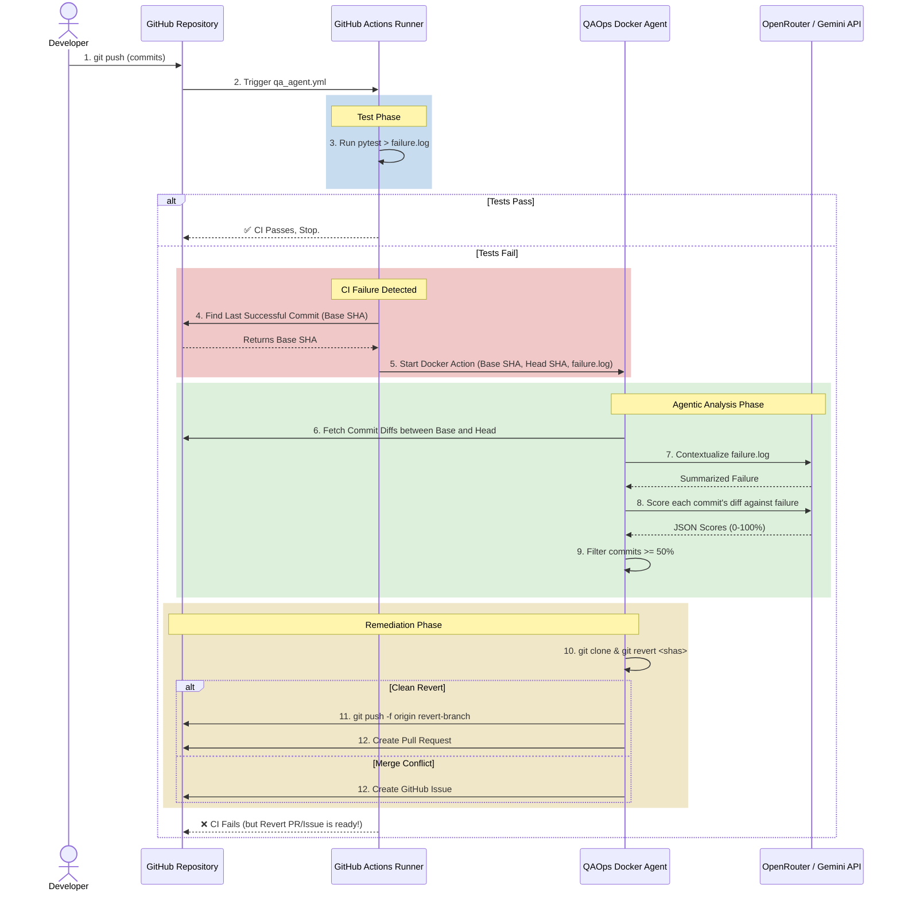

# QAOps Agent Workflow & Architecture

Here is the complete end-to-end flow of how your Intelligent QAOps Agent operates in a production CI/CD environment, along with a breakdown of its internal file structure.

## File Structure & Roles

The `QAOps` repository is divided into two parts: the **GitHub Action Wrapper** and the **Python Core Engine**.

### 1. GitHub Action Wrapper
These files bridge the gap between GitHub's infrastructure and the Python code.

*   **`action.yml`**: The "Interface". This is the metadata file that tells GitHub this repository is a custom Action. It defines what inputs the user can provide (e.g., `repo`, `base`, `openrouter_api_key`) and maps them to Docker environment variables (`$INPUT_REPO`).
*   **`Dockerfile`**: The "Environment". This packages your Python code into a portable Linux container. It ensures Python 3.10 is installed, installs system tools like `git` (which the agent needs for reverting), and installs the Python requirements.
*   **`entrypoint.sh`**: The "Bridge". When the Docker container starts, it runs this bash script. This script grabs the GitHub `$INPUT_*` variables and passes them as standard command-line flags to your Python application (e.g., `fault-localizer --repo $INPUT_REPO`).

### 2. Python Core Engine (`src/`)
This is the actual software that performs the logic.

*   **`setup.py`**: The "Installer". It defines the project's dependencies (LangChain, PyGithub, etc.) and registers the `fault-localizer` terminal command so it can be executed from anywhere.
*   **`src/fault_localizer/cli.py`**: The "Orchestrator" (Entry Point). This is the main function of the app. It parses the command-line arguments, boots up the GitHub client to fetch commits, boots up the AI agent to score them, prints the fancy terminal output, and decides whether to trigger the auto-revert logic based on the scores.
*   **`src/fault_localizer/core/config.py`**: The "Configuration Manager". It loads API keys and settings from the environment variables. It ensures strings are stripped of quotes or extra spaces so the API clients don't crash.
*   **`src/fault_localizer/integrations/github.py`**: The "Hands". It handles all communication with GitHub. It has two main jobs: fetching the commit diffs via the GitHub API, and acting as a robotic developer (running `git clone`, `git revert`, `git push -f`, and opening Pull Requests/Issues).
*   **`src/fault_localizer/agents/fault_localizer.py`**: The "Brain". This contains the AI logic built using LangGraph and LangChain. It takes the raw failure logs and diffs, wraps them in highly specific prompt templates, sends them to OpenRouter (or Google Gemini), and parses the AI's response into a structured JSON score and reasoning.

---

## Sequence Diagram

## Step-by-Step Breakdown

### 1. The Trigger
A developer pushes new code to the repository. This triggers the GitHub Actions workflow (`qa_agent.yml`).

### 2. The Test Suite
The workflow runs the standard unit tests (`pytest`). We use `continue-on-error: true` and pipe the output to `failure.log`. 
- If the tests **pass**, the workflow finishes successfully and the QAOps agent never wakes up.
- If the tests **fail**, the workflow moves to the next step.

### 3. Calculating the Window of Suspicion
The workflow uses the GitHub CLI (`gh api`) to search the repository's history for the **last successful test run**. This commit becomes the `--base`. The latest commit becomes the `--head`. This ensures the agent analyzes *every single commit* that occurred between the last time the code worked and the current broken state.

### 4. Agent Initialization (Docker)
GitHub boots up the QAOps Docker container (`action.yml` -> `Dockerfile`). It mounts the repository workspace into the container so the Python code can read the `failure.log` and injects the API Keys securely as environment variables.

### 5. Semantic Analysis (LangGraph)
The Python agent takes over:
1. **Contextualize:** It sends the raw `failure.log` to the LLM to extract the core semantic error (e.g., *"AssertionError: add(2,3) returned -1"*).
2. **Fetch:** It queries the GitHub API for the code diffs of all commits in the suspicion window.
3. **Score:** It asks the LLM to act as a DevOps engineer and grade the probability (0-100) that each specific diff caused the summarized failure.

### 6. Automated Remediation
The agent filters the results, keeping only commits with a score of `50%` or higher.
- It performs a fresh `git clone` of your repository into a temporary directory using the `GITHUB_TOKEN`.
- It sequentially runs `git revert` on all the guilty commits.
- **Success:** It force-pushes the reverted code to a new branch and uses the GitHub API to open a unified Revert Pull Request.
- **Failure:** If the `git revert` fails due to a complex merge conflict, the agent catches the error, aborts the Git operation, and creates a GitHub Issue containing the error logs so developers can manually intervene.
